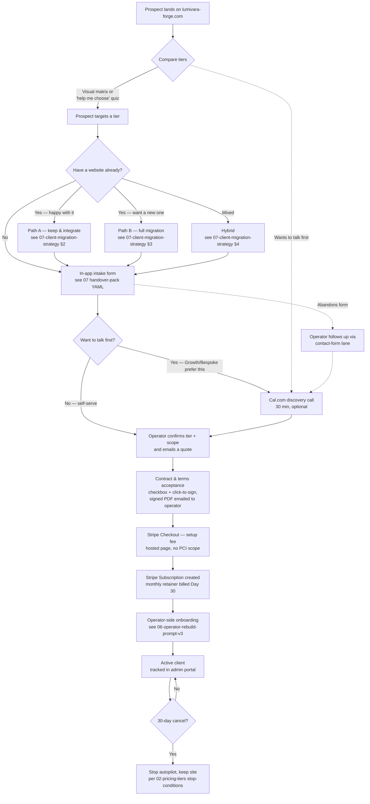

# 09 — Purchase Flow (Phase 1: design only)

> _Lane: 🛠 Pipeline — operator-only design doc for the Lumivara Forge prospect funnel._
>
> **Status:** Phase 1 design awaiting operator approval. **No in-app code lands until the §8 approval checklist is ticked.** Phase 2 (intake-form route, Stripe wiring, contract UI, Cal.com embed) is tracked as separate follow-up issues that depend on this doc.
>
> **Audience:** primary = operator + future Phase-2 implementers (Claude / Codex / Gemini). The locked recommendations and the §8 open decisions are the only sections an operator-facing reader needs to skim.
>
> **Brand context:** the practice operates under **Lumivara Forge** (locked 2026-04-28; see `../mothership/15-terminology-and-brand.md §4`). The operator domain `lumivara-forge.com` is **pending registration** (`mothership/15 §5`); until it resolves, the interim demo URL the operator stands up under [`palimkarakshays-projects` on Vercel](https://vercel.com/palimkarakshays-projects) is the working live link. References below treat `lumivara-forge.com` as the locked future home of this funnel.

---

## How to read this doc

Eight sections. Each recommendation lists the **choice**, the **runner-up**, and the **trade-off** in ≤ 6 lines so an operator can skim and ratify or override without reading the whole doc.

1. [Flow diagram](#1--flow-diagram)
2. [Intake form schema](#2--intake-form-schema)
3. [Tier comparison UX](#3--tier-comparison-ux)
4. [Payment processor decision](#4--payment-processor-decision)
5. [Contract / terms acceptance](#5--contract--terms-acceptance)
6. [Demo placement](#6--demo-placement)
7. [State machine](#7--state-machine)
8. [Open decisions for the operator](#8--open-decisions-for-the-operator)

The **locked recommendations** (subject to §8 ratification) are:

- **Payment processor** = **Stripe Checkout** for the setup fee + **Stripe Subscriptions** for the monthly retainer.
- **Intake host** = **in-app form** (own the data; brand consistency; Tally as fallback if dev capacity is the bottleneck).
- **Demo modality** = **live lumivara-forge.com itself** + an optional 30-min **Cal.com** discovery slot for Tier 2 / Tier 3 prospects.
- **Tier UX** = **visual matrix** (mirroring [`02-pricing-tiers.md`](./02-pricing-tiers.md)) plus an **optional 4-question quiz** that recommends a tier.

---

## §1 — Flow diagram

The end-to-end prospect journey, from landing on the funnel to becoming an active retainer client. Mermaid source lives standalone at [`assets/purchase-flow.mmd`](./assets/purchase-flow.mmd) so it can be rendered with `npx -y @mermaid-js/mermaid-cli -i assets/purchase-flow.mmd -o assets/purchase-flow.png` and dropped into a deck.

**Notes on the flow.**

- The **"Have a website already?"** branch is load-bearing — it gates which migration sub-form (`07-client-migration-strategy.md` §2 / §3 / §4) renders downstream. A prospect who answers "yes" sees three follow-up questions before the main intake; a prospect who answers "no" goes straight to intake.
- The **"Want to talk first?"** branch routes the prospect to a Cal.com discovery slot. We default Tier 0 / Tier 1 to self-serve and Tier 2 / Tier 3 to discovery-first, but prospects can override either way.
- **Drop-off recovery** has a single fallback path: the existing `/contact` form lane stays live throughout — a prospect who abandons the in-app intake is contacted from there.
- **Onboarding** after `paid_setup` hands off to [`06-operator-rebuild-prompt-v3.md`](../mothership/06-operator-rebuild-prompt-v3.md), which is already the canonical per-engagement playbook. This doc deliberately stops at "active client" and does not duplicate the onboarding runbook.

---

## §2 — Intake form schema

**Choice: in-app form.** Reasons: (1) we own the submissions and the audit trail; (2) brand consistency with the rest of the funnel; (3) lower per-submission fees than Tally/Typeform's paid tiers once volume crosses ~50/month; (4) it sets up the magic-link `/admin` sign-in path in `src/lib/admin/*` so the same email becomes the post-payment login.

**Runner-up: Tally.** A 1-week-to-launch fallback if Phase 2 dev capacity becomes the bottleneck. Tally is free for unlimited submissions and supports webhook → operator email + an export to JSON. Trade-off: a brand seam between `lumivara-forge.com` and `tally.so/r/...`, plus a second tool to manage.

**What the form must produce.** A YAML payload that maps 1:1 onto [`../mothership/07-client-handover-pack.md`](../mothership/07-client-handover-pack.md)'s per-client intake schema, so a Phase-2 executor can pipe answers straight into the handover render without a translation layer. The machine-readable spec is at [`assets/intake-form-schema.json`](./assets/intake-form-schema.json).

**Field list (summary — full version in the JSON spec).**

| Field | Type | Req | Maps to handover key |
|---|---|---|---|
| `client_slug` | text (slug) | ✅ | `client_slug` |
| `client_name` | text | ✅ | `client_name` |
| `client_legal_name` | text | ✅ | `client_legal_name` |
| `client_descriptor` | text | ✅ | `client_descriptor` |
| `client_location` | text | ✅ | `client_location` |
| `client_primary_email` | email | ✅ | `client_primary_email` |
| `client_primary_phone` | tel (E.164) | optional, required at Tier 1+ | `client_primary_phone` |
| `tier` | select 0/1/2/3 | ✅ | `tier` |
| `primary_cta` | text | ✅ | `primary_cta` |
| `domain` | hostname | ✅ | `domain` |
| `registrar` | select | ✅ | `registrar` |
| `page_list` | checkbox-multi-with-other | ✅ | `page_list` |
| `voice_adjectives` | text-multi (3) | ✅ | `voice_adjectives` |
| `mood_adjectives` | text-multi (3) | ✅ | `mood_adjectives` |
| `reference_sites` | text-multi (0–3) | optional | _(not in handover schema today — see §8)_ |
| `logo_assets` | file-multi | optional | _(operator-side)_ |
| `existing_copy` | file-multi | optional | _(operator-side)_ |
| `integrations` | checkbox-multi | optional | `integrations` |
| `have_existing_site` | select | ✅ | _(routes to migration playbook)_ |
| `existing_site_url` | url | conditional | _(migration sub-form)_ |
| `existing_site_platform` | select | conditional | _(migration sub-form)_ |
| `wants_discovery_call` | boolean | optional | _(routes to Cal.com)_ |
| `notes` | textarea | optional | `notes` |
| `consent_terms` | required checkbox | ✅ | _(contract step — §5)_ |

Every required handover-pack field that originates from the client is represented. Handover keys not collected at intake (e.g. `tier_name`, `included_edits`, `cal_link`, `twilio_inbound_number`) are derived at render time or provisioned by the operator post-payment — those are listed under `handover_keys_not_collected_at_intake` in the JSON spec.

**Path-A sub-form question.** Per the plan's open question, do Path A prospects fill in a slimmer schema? Recommendation: **same schema, conditional rendering**. The `have_existing_site` answer controls which downstream sections show (e.g. `existing_site_url` + `existing_site_platform` only render for Path A / B / Hybrid). One source of truth, less branching to maintain.

**Anti-spam.** Phase 2 reuses the patterns in `src/app/api/contact/*` (rate-limit + honeypot + Resend forwarding). **This PR makes no edit to that route** — the intake form's API handler will be a separate file under `src/app/api/intake/*` with its own anti-spam stack copied from the existing pattern.

---

## §3 — Tier comparison UX

**Choice: visual matrix + optional quiz.** The matrix mirrors the table at [`02-pricing-tiers.md §"The ladder at a glance"`](./02-pricing-tiers.md). The quiz is a 4-question "help me choose" widget that pre-selects a tier on the matrix.

**Runner-up: quiz-only.** Trade-off: a quiz hides the price ladder behind a click, which feels evasive on first visit and is harder to share — a prospect cannot link a colleague to "the row I'm looking at." A matrix is scannable, transparent, and copy-pasteable into a follow-up email. The quiz is the *helper*, not the *gate*.

**Quiz questions** (mapped to the decision tree in [`02-pricing-tiers.md §"Client decision tree"`](./02-pricing-tiers.md)):

1. Do you have a website today? (No / Yes-happy / Yes-frustrated / Yes-mixed)
2. How often do you want to update it? (Almost never / A few times a quarter / Most weeks / Multiple sites or integrations)
3. Will more than one person edit it? (Just me / 2–3 / 4+ / We don't know yet)
4. Do you need any of these built-in? (Booking / Newsletter / Chat / Multi-language / None — pick all that apply)

The recommendation surfaces with a one-line rationale ("You said 'most weeks' + 'just me' → Tier 2 — Autopilot Pro: unlimited phone edits, monthly improvement run.") and a **"Show me the matrix instead"** escape hatch. The prospect can override the recommendation in one click — the quiz never *forces* a tier.

**Continuity with `/lumivara-infotech`.** The live page already presents three tier cards (Launchpad / Growth / Bespoke). The matrix is a side-by-side extension, not a replacement — Phase 2 wires the quiz to the same tier slugs the cards already use. The four-tier vs. three-tier divergence between [`02-pricing-tiers.md`](./02-pricing-tiers.md) and the live page is flagged in §8.

---

## §4 — Payment processor decision

**Choice: Stripe Checkout (hosted page) for the setup fee + Stripe Subscriptions for the monthly retainer.** Lowest dev effort, no PCI scope on our end, native CAD support, recurring-billing primitives that match our 30-day-cancel terms.

**Runner-up: Square.** Cheaper Canadian per-transaction fee on cards but no usable recurring-billing primitive (Square's "Invoices Plus" sub is recurring-invoice only, not a card-on-file subscription); subscription-style billing requires bolting on a separate tool. Trade-off rejected.

**Side-by-side.**

| Criterion | Stripe Checkout + Subscriptions | Square Online | PayPal |
|---|---|---|---|
| Per-transaction fee (CAD card) | 2.9% + CAD $0.30 | 2.65% + CAD $0.10 | 2.9% + CAD $0.30 |
| Recurring-billing native? | ✅ Subscriptions API | ⚠️ recurring invoices only | ✅ Subscriptions API |
| Canadian-merchant friction | Low (1-day onboarding) | Low | Medium (frequent business-verification holds reported) |
| Payout cadence | T+2 (CAD); T+7 default until volume | T+1 (CAD) | T+3 typically; held funds are common |
| Dispute tooling | Stripe Radar + chargeback evidence flow | Square's basic chargeback flow | Resolution Center (well known to be merchant-unfriendly) |
| Refund UX | One-click partial / full from dashboard | One-click | Multi-step |
| Dev effort to wire (Phase 2) | **Lowest** — `stripe-node` + a Checkout Session + a webhook handler | Medium — Square SDK + custom recurring-invoice trigger | Medium — recurring-billing SDK is awkward |
| Hosted page (no PCI scope on us)? | ✅ Stripe-hosted Checkout URL | ✅ Square-hosted | ✅ |

**Why Stripe Checkout (hosted) and not custom Stripe Elements?** Hosted Checkout means we never touch a card-number DOM node — Stripe owns the PCI scope, the 3DS flow, and the receipt template. Phase 2 wiring is roughly: create a Checkout Session server-side, redirect the prospect to `https://checkout.stripe.com/...`, handle the `checkout.session.completed` webhook to create a Subscription and unlock the post-payment onboarding. That's ~150 lines of TypeScript and one webhook route, not a card-form component.

**Replaces the current manual flow.** The existing FAQ at [`src/content/lumivara-infotech.ts:169-172`](../../src/content/lumivara-infotech.ts) describes invoicing via Interac e-Transfer / wire / major card with a 50-50 split. Once Stripe is wired, that FAQ becomes inaccurate. **Phase 2 must rewrite that copy** — the dependency is recorded in §8 so it is not forgotten.

**Currency.** [`02-pricing-tiers.md`](./02-pricing-tiers.md) lists CAD and USD prices per tier. Stripe charges in one settlement currency per Stripe account; auto-conversion at checkout is supported but adds a 1% currency-conversion fee. Whether we run **one CAD account with auto-conversion** or **two accounts (CAD + USD)** is an open decision (§8) — both are viable, the choice is operational, not technical.

---

## §5 — Contract / terms acceptance

**Choice: single-screen step with a required checkbox + click-to-sign confirmation.** The acceptance triggers a server-side render of a templated PDF (client name, legal entity, tier, setup fee, monthly fee, signature date) which the chosen e-sign tool delivers to both the operator and the client.

**Runner-up: external e-sign redirect.** A prospect leaves the funnel for DocuSign / SignWell / Dropbox Sign, signs there, returns. Trade-off: clean legal trail but a high-friction redirect at the highest-conversion-cost moment of the flow. We accept the legal weight of click-to-sign for Tier 0 / Tier 1 / Tier 2 (small-business contracts) and reserve the redirect for Tier 3 / Tier 4 where the dollar values warrant it.

**Required clauses** (pulled from existing operator material — single source of truth lives in `02-pricing-tiers.md` "Stop conditions" + `01-gig-profile.md` Part 6 FAQ):

1. **Cancellation.** 30 days' notice on the monthly retainer, per tier ([`02-pricing-tiers.md` Tier 1+ "Stop conditions"](./02-pricing-tiers.md)).
2. **Ownership transfer.** Client owns the code, the domain, the hosting account from day one ([`01-gig-profile.md` FAQ "Who owns the site after we're done?"](./01-gig-profile.md)).
3. **Autopilot stop-on-cancel.** The phone-edit pipeline stops accepting requests after the cancellation date; the site itself remains live ([`02-pricing-tiers.md` "Stop conditions"](./02-pricing-tiers.md)).
4. **Refund policy.** Strawman for operator approval: setup fee non-refundable after the kickoff call; fully refundable before. Monthly retainer never refundable (cancelling mid-month covers that month). Wording flagged in §8.
5. **Out-of-scope changes.** Anything beyond the tier scope is a custom offer with its own price ([`01-gig-profile.md` Part 11](./01-gig-profile.md)).
6. **Compliance.** Privacy clause references PIPEDA explicitly; GDPR add-on if requested. The legal/insurance work tracked in `../mothership/08-future-work.md` is the canonical home for jurisdictional updates.

**E-sign tool.** Procurement decision out of scope for this doc — DocuSign, SignWell, Dropbox Sign, and a self-hosted PDF + checkbox are all viable. Pros/cons listed in §8 as an open decision.

---

## §6 — Demo placement

**Choice: live `lumivara-forge.com` itself, embedded in the tier-comparison page as the demo, plus an optional 30-minute Cal.com discovery slot before payment for Tier 2 / Tier 3 prospects.**

**Runner-up: a recorded video demo.** Trade-off: a recording goes stale the moment we ship a meaningful update; the live site is, by definition, never stale. The live site is also **the proof itself** — a prospect cannot watch a recording and ask "is this real?" the way they can with a screen capture.

**Why the discovery call is optional.** Tier 0 and Tier 1 are designed for self-serve — the discovery call is friction that reduces conversion. Tier 2 and Tier 3 prospects are higher-stakes and benefit from a 30-min scope conversation before paying — the call is the friction we *want* there. The boolean `wants_discovery_call` field in §2 lets the prospect override either default.

**Cal.com mechanics.** The Cal.com slot is provisioned per-engagement on Tier 1+ already (see [`../mothership/07-client-handover-pack.md`](../mothership/07-client-handover-pack.md) `cal_link`), so the operator's account is the source of truth. Phase 2 embeds Cal.com's inline widget on the tier-comparison page; no new accounts to provision.

**Why we don't gate the demo behind the form.** The live site is publicly visible. Gating it would mean rebuilding what already exists. The intake form is the gate; the demo is the open door.

---

## §7 — State machine

The prospect status states the funnel produces, with the artefact that proves each transition. Phase 2 wires these into the admin portal so the operator can see every prospect's stage at a glance.

| State | Transition into this state proven by | Operator surface |
|---|---|---|
| `browsing` | _(default)_ — prospect on the funnel, no form submission | none — analytics-only |
| `intake_submitted` | `POST /api/intake` returned 200 + Resend confirmation email sent | Admin portal: new row in `prospects` table |
| `quote_sent` | Operator emailed a quote with line items + Stripe Checkout link | Admin portal: state field updated |
| `demo_booked` | Cal.com webhook → booking created | Admin portal: linked Cal.com event ID |
| `contract_signed` | Click-to-sign POST returns 200 + signed-PDF email sent | Admin portal: linked PDF URL |
| `paid_setup` | Stripe webhook `checkout.session.completed` for the setup-fee Checkout Session | Admin portal: linked Stripe payment intent |
| `active` | Stripe Subscription created + first per-engagement run kicked off | Admin portal: linked Stripe subscription |
| `cancelled` | Stripe webhook `customer.subscription.deleted` OR operator-triggered cancel | Admin portal: cancellation date + retention surface |

**State transitions are append-only.** The admin portal records every transition (with timestamp + actor) so we have a full audit trail per prospect — the same evidence-log discipline as `../mothership/19-engagement-evidence-log-template.md`.

**Recovery rules.** A prospect in `intake_submitted` for >7 days without a `quote_sent` is auto-flagged for operator follow-up. A prospect in `quote_sent` for >14 days without `contract_signed` is auto-archived to a `dormant` state (not lost — re-engageable later with a single email).

---

## §8 — Open decisions for the operator

**Phase 2 cannot start until every box below is ticked.** Each item is a decision, not an implementation step — the answers feed directly into the follow-up issue scopes.

- [ ] **Payment processor (locked recommendation: Stripe Checkout + Subscriptions).** Confirm or override.
- [ ] **Stripe currency strategy.** One CAD account with auto-conversion at checkout, **or** two accounts (CAD + USD)? The former is operationally simpler; the latter eliminates the 1% conversion fee on USD payments.
- [ ] **Setup-fee refund policy wording.** Strawman: "non-refundable after kickoff call, fully refundable before." Operator to confirm or replace; the wording goes into the contract template (§5) and the `/legal/refund-policy` route.
- [ ] **E-sign tool.** Pick one: DocuSign (most-recognised, ~CAD $25/user/mo) / SignWell (cheapest mainstream, ~CAD $10/mo) / Dropbox Sign (was HelloSign; ~CAD $20/mo) / hosted-PDF + checkbox (free, weakest legal weight). Decision feeds the contract step (§5).
- [ ] **Intake host.** Locked recommendation: in-app. Confirm, or fall back to Tally if Phase 2 dev capacity is the bottleneck — the Tally-fallback decision is reversible at any time.
- [ ] **Demo modality.** Locked recommendation: live `lumivara-forge.com` + optional Cal.com slot. Confirm.
- [ ] **Brand surface for the funnel.** `/lumivara-infotech` lives on Client #1's site today (a flagged Dual-Lane Repo violation per [`src/app/lumivara-infotech/page.tsx:9-16`](../../src/app/lumivara-infotech/page.tsx)). Do Phase-2 routes ship under the current `/lumivara-infotech` slug as a stopgap, or wait for the relocation to `lumivara-forge.com`? Tracked in `../mothership/15c-brand-and-domain-decision.md`.
- [ ] **Tier-ladder reconciliation.** [`02-pricing-tiers.md`](./02-pricing-tiers.md) ships **four** tiers (T0 Launch / T1 Autopilot Lite / T2 Autopilot Pro / T3 Business). The live `/lumivara-infotech` page ships **three** (Launchpad / Growth / Bespoke) at different prices. The intake schema follows `02-pricing-tiers.md` (canonical operator doc); the on-site copy is the divergence to fix in Phase 2 — operator picks whether the storefront upgrades to four tiers or `02-pricing-tiers.md` collapses to three.
- [ ] **Tier-name harmonisation.** Same divergence as above but isolated to the names — does the funnel use **Launch / Autopilot Lite / Autopilot Pro / Business**, or **Launchpad / Growth / Bespoke + a fourth**, or some new pair? Affects every prospect-facing surface.
- [ ] **`reference_sites` field in the handover schema.** The intake form collects three reference sites + one-sentence reasons (per [`01-gig-profile.md` §7 question 7](./01-gig-profile.md)). [`../mothership/07-client-handover-pack.md`](../mothership/07-client-handover-pack.md) does not have a matching key. Strawman: add `reference_sites` to the handover schema. Operator to ratify.
- [ ] **`/lumivara-infotech` FAQ rewrite (Phase 2 dependency).** The "How does payment work?" entry at [`src/content/lumivara-infotech.ts:169-172`](../../src/content/lumivara-infotech.ts) describes the manual e-Transfer / wire / card flow. Phase 2 must replace it with Stripe-Checkout copy. Tracked here so the rewrite issue isn't dropped.
- [ ] **Path A intake variant.** Recommendation: **same schema, conditional sections** (the `have_existing_site` answer toggles the migration sub-form). Confirm, or split into two routes (more code, more drift risk).
- [ ] **Phase 2 follow-up issue creation.** Once the above are ticked, the operator opens issues for: (1) intake-form route + API handler; (2) tier-comparison matrix + quiz component; (3) Stripe Checkout session + webhook handler; (4) contract acceptance UI + e-sign integration; (5) Cal.com embed; (6) FAQ rewrite at `src/content/lumivara-infotech.ts`; (7) admin-portal `prospects` surface for the §7 state machine. None of these are opened by this PR.

---

## Phase 2 — what gets built once §8 is ratified

**Not in scope for this PR.** Listed for completeness so the operator knows what each ratification unlocks.

| Phase-2 issue | Files touched | Depends on §8 item |
|---|---|---|
| Intake-form route + API handler | new under `src/app/get-started/`, new `src/app/api/intake/route.ts` (mirrors anti-spam pattern from `src/app/api/contact/*` — that route is **not** edited) | Intake host, tier-name harmonisation |
| Tier-comparison matrix + quiz | new under `src/app/pricing/` (or extend `src/app/lumivara-infotech/`), new component in `src/components/pricing/` | Brand surface, tier-ladder reconciliation |
| Stripe Checkout + Subscription wiring | new `src/app/api/stripe/checkout/route.ts`, new `src/app/api/stripe/webhook/route.ts`, env vars `STRIPE_SECRET_KEY` + `STRIPE_WEBHOOK_SECRET` (Vercel mirror required) | Stripe currency strategy, refund-policy wording |
| Contract acceptance UI + e-sign | new `src/app/contract/page.tsx`, new `src/app/api/contract/sign/route.ts`, env var for the chosen e-sign tool's API key (Vercel mirror required) | E-sign tool |
| Cal.com inline embed | extend tier-comparison page; no new env vars (Cal.com inline widget is public) | Demo modality |
| FAQ rewrite (`/lumivara-infotech`) | edit `src/content/lumivara-infotech.ts` "payment" FAQ | Payment processor (locked) |
| Admin-portal prospects surface | new under `src/app/admin/prospects/`, extend `src/lib/admin/*` | All of the above (consumes the state machine) |

Each Phase-2 issue must carry the `needs-vercel-mirror` label when it introduces an env var or a route-config change, per the AGENTS.md `Vercel production parity` rule.

---

*Last updated: 2026-04-30. Authored by the Opus execute pass on issue #111.*
